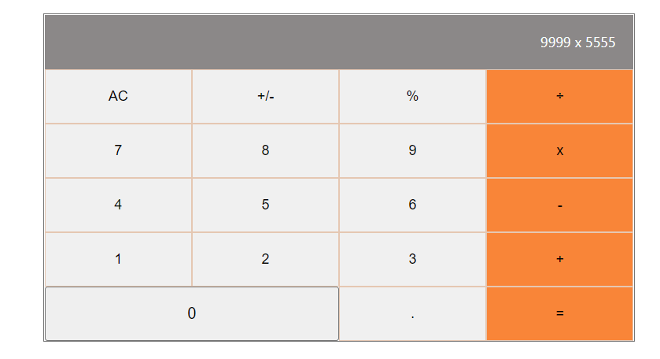

# Math Magician App 

> A web app developed using `React`. It's a simple calcualtor application. It also has a small router for about pages. Other than calculator all pages are static components.

## Built With

- HTML5
- CSS3
- React JS

## Live Demo (if available)

[Live Demo Link](https://react-calculator-web.herokuapp.com/)

## Getting Started

- **`git clone https://github.com/RitobrotoMukherjee/math-magician.git`**
- **`cd math-magician`**
- **`npm run install`**
- **`npm run start`**

## Authors

👤 **Ritobroto Mukherjee**

- Portfolio: [@Rito](https://ritobrotomukherjee.github.io/Work-Portfolio/)
- GitHub: [@RitobrotoMukherjee](https://github.com/RitobrotoMukherjee)
- Twitter: [@RitobrotoM3](https://twitter.com/RitobrotoM3)
- LinkedIn: [Ritobroto Mukherjee](https://www.linkedin.com/in/ritobroto-mukherjee-519148ba/)

## Screenshots

## 🤝 Contributing

Contributions, issues, and feature requests are welcome!

Feel free to check the [issues page](../../issues/).

## Show your support

Give a ⭐️ if you like this project!

## Acknowledgments

- Microverse
- React

## 📝 License

This project is [MIT](./MIT.md) licensed.

## Code Reviewers
- Francis Ugorji [@GitHub](https://github.com/Gambit142)
- Arslan Bisharat[@GitHub](https://github.com/arslanbisharat)
- Zerradi Amine[@GitHub](https://github.com/dasileker)
- Lameck Otieno [@GitHub](https://github.com/Lameck1)
- Juliana Ifionu[@gitHub](https://github.com/julie-ify)
